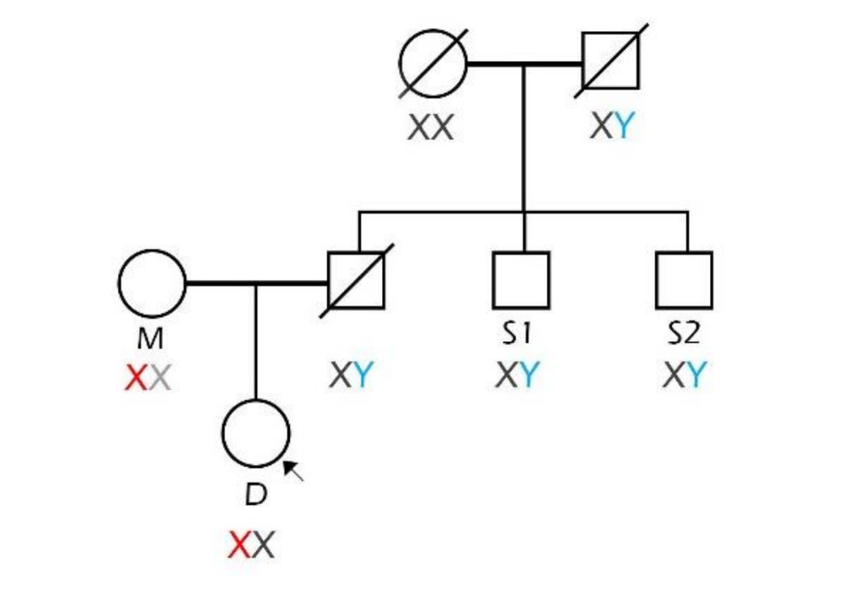

## Zadanie 3 (5b)

V tomto zadaní budete pracovať s nástrojom FamLinkX a datasetom **dna_screening_zadanie** dostupným v priečinku `inputs`. 

Dataset obsahuje údaje matky, dcéry a dvoch strýkov, ktorí sú bratmi muža, u ktorého predpokladáme, že je otcom dcéry. Je potrebné potvrdiť alebo vyvrátiť či bol muž otcom dievčaťa. Pomocou nástroja FamLinkX zostavte hypotézy s rodokmeňom členov, vykonajte analýzu, určte výsledné pravdepodobnosti hypotéz a uveďte výsledné rozhodnutie na potvrdenie/zamietnutie otcovstva.

### Úloha 1 (1b)

**Formulujte hypotézy pre riešenie úlohy:**

Hypotéza H1: Strýko_1 a Strýko_2 sú biologický bratia otca dieťaťa. 
Hypotéza H0: Strýko_1 a Strýko_2 nie sú dieťaťu bilogicky príbuzní príbuzní, a teda otec nie je biologickým otcom dieťaťa.

### Úloha 2 (4b)

Vykonajte analýzu pomocou nástroja FamLinkX. Ako referenčnú databázu použite Českú alebo Nemeckú databázu. Ako prílohu zadania odovzdajte vygenerovaný report z analýzy (Case report vo formáte .rtf). 

**Uveďte LR a pravdepodobnosť (W) pre jednotlivé hypotézy a Váš záver analýzy:**

H1:
    InLikelihood = -84.9882
    LR = 7.043 * 10^6
    W = 0.99999986

H2:
    InLikelihood = -100.7557
    LR = 1
    W = 1,419922 * 10^(-7)

Vyšlo nám, že Hypotéza H1, teda že strýkovia sú bilogickými bratmi otca dieťaťa je pravdivá na 99.9999%. 
Teda to potvrdzuje, že otec je biologickým otcom.