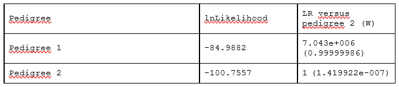

## Zadanie 3 (5b)

V tomto zadaní budete pracovať s nástrojom FamLinkX a datasetom **dna_screening_zadanie** dostupným v priečinku `inputs`. 

Dataset obsahuje údaje matky, dcéry a dvoch strýkov, ktorí sú bratmi muža, u ktorého predpokladáme, že je otcom dcéry. Je potrebné potvrdiť alebo vyvrátiť či bol muž otcom dievčaťa. Pomocou nástroja FamLinkX zostavte hypotézy s rodokmeňom členov, vykonajte analýzu, určte výsledné pravdepodobnosti hypotéz a uveďte výsledné rozhodnutie na potvrdenie/zamietnutie otcovstva.

### Úloha 1 (1b)

**Formulujte hypotézy pre riešenie úlohy:**

H0 (pedigree 1) = Tretí brat (muž) je biologickým otcom dietaťa

HA (pedigree 2) = Tretí brat (muž) nie je otcom dietaťa
### Úloha 2 (4b)

Vykonajte analýzu pomocou nástroja FamLinkX. Ako referenčnú databázu použite Českú alebo Nemeckú databázu. Ako prílohu zadania odovzdajte vygenerovaný report z analýzy (Case report vo formáte .rtf). 

**Uveďte LR a pravdepodobnosť (W) pre jednotlivé hypotézy a Váš záver analýzy:**

Pedigree 1      lnLikelihood : -84.9882            LR versus pedigree 2 (W) : 7.043e+006(0.99999986)

Pedigree 2      lnLikelihood : -100-7557           LR versus pedigree 2 (W) : 1 (1.419922e-007)

W = LR/(LR+1) = (7.043*10^6)/(7.043*10^6+1) = 0.99999986

Dospel som k záveru, že pravdepodobnosť otcovstva (H0 hypotéza) dosahuje takmer 99.999986 %. To predstavuje veľmi silnú genetickú evidenciu v prospech tvrdenia, že muž je otcom dieťaťa a strýko 1 a 2 sú príbuzný.
