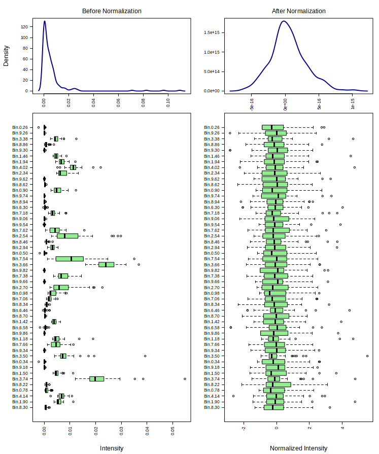
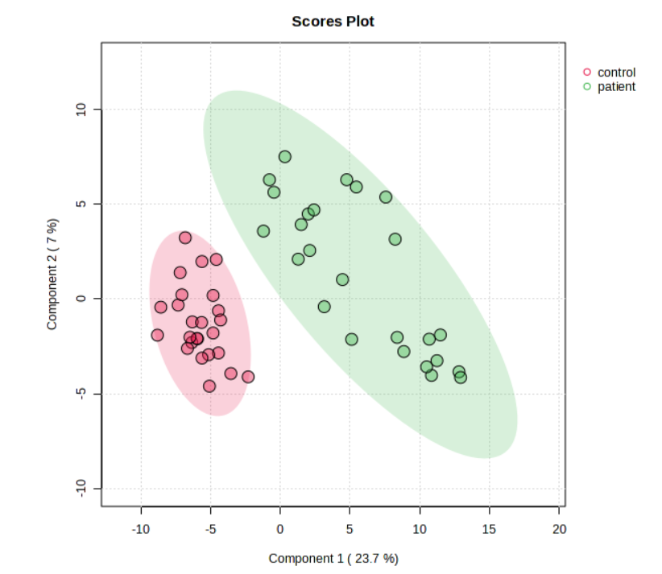
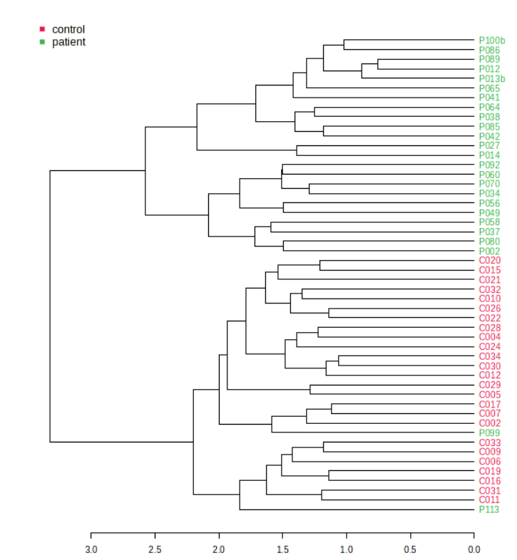
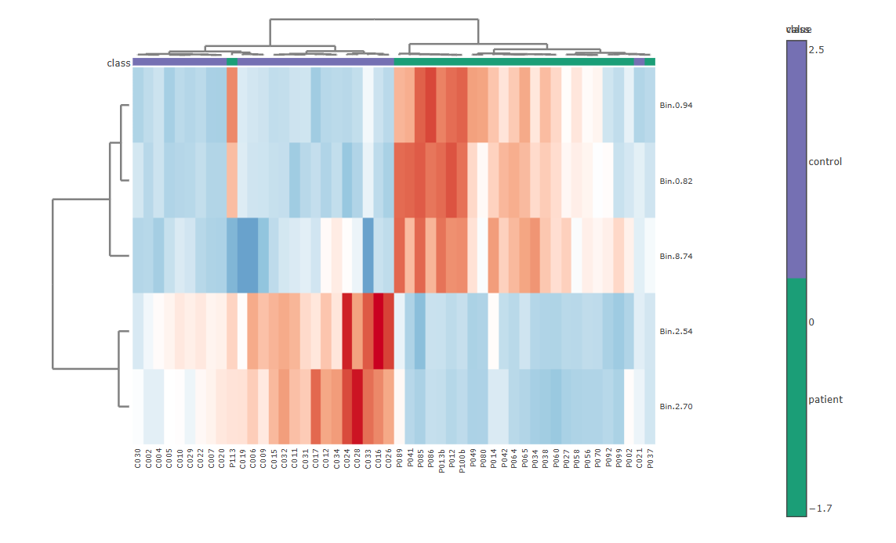
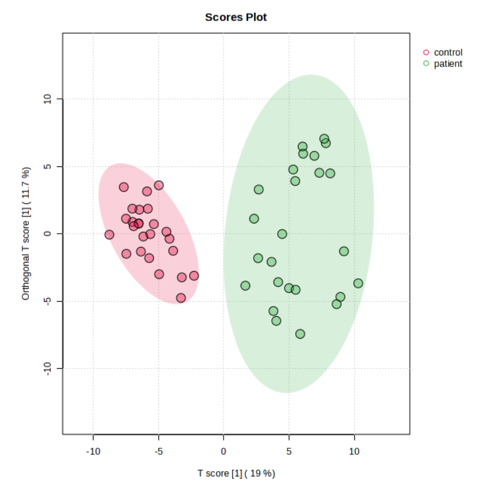
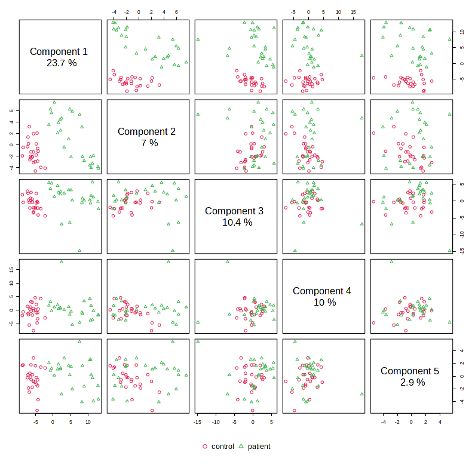

## Zadanie 4 (5b)

V tomto zadaní budete pracovať s nástrojom MetaboAnalyst a datasetom: **NMR spectral bins**
    
`Binned 1H NMR spectra of 50 urine samples using 0.04 ppm constant width (Psihogios NG, et al.) Group 1- control; group 2 - severe kidney disease.`
    
Tento dataset je dostupný v sekcii 'Try our test data' v nástroji pre Jednofaktorovú štatistickú analýzu. 

Dataset pochádza z NMR-metabolomickej štúdie: Hodnotenie závažnosti tubulointersticiálnych lézií u pacientov s glomerulonefritídou. Začiatok tubulointersticiálnych lézií je charakterizovaný zníženým vylučovaním citrátu, hipurátu, glycínu a kreatinínu, zatiaľ čo po ďalšom zhoršení nasleduje glykozúria, selektívna aminoacidúria, úplné vyčerpanie citrátu a hipurátu a postupné zvyšovanie vylučovania laktátu, acetátu a trimetylamín-N-oxidu. Metabonomická analýza moču založená na NMR by mohla prispieť k včasnému hodnoteniu závažnosti poškodenia obličiek a prípadne k monitorovaniu ich funkcie. [1]

Načítajte množinu údajov v nástroji MetaboAnalyst. Pri filtrovaní údajov (Data filter) môžete použiť predvolené nastavenia.

### Úloha 1 (1b)

Normalizujte distribúciu datasetu (pre premenné aj vzorku).
(Vyberte akúkoľvek kombináciu operácií, ktorá je podľa Vás najlepšia).

**Ktoré operácie ste pri normalizácii použili?**

Sample normalization: normalization by median

Data Transformation:  square root transformation

Data Scaling:         auto scaling

### Úloha 2 (4b)

Použite ľubovoľné štatistické metódy na analýzu datasetu (napr. t-test, correlations, PCA, PLS-DA, Dendrogram, Heatmap, K-means, RandomForest, ..) 

**Uveďte aspoň 4 skutočnosti (z 4 rôznych metód), ktoré ste zistili analýzou datasetu:**

(Napr. Pri použití pearsonovho korelačného koeficientu je najvyššia pozitívna korelácia medzi premennými x a y, a koeficient korelácie je 0.992.)

1: Partial Least Squares Discriminant Analysis (PLS-DA)
    - podľa 2D scores plot vidíme že pacienti sú oddelený od kontrolnej skupiny vo vlastných zhlukoch, ktoré sa neprekrývjú

2: Hierarchical Clustering Dendrogram
    - podľa dendrogramu vidíme že pacienti a kontrolná vzorka sa väčšinou zhlukujú do samostatných skupín, čo naznačuje že je medzi
nimi signifikantný rozdiel

    - Distance Measure: Pearson
    - Clustering Algorithm: Average

3: Hierarchical Clustering Heatmaps
    - vyjadruje expresiu génov skupín patient zelenou a control fialovou
    
    - zobrazenie na top 5, červená - vyššia hodnota, modrá - nižšia hodnota, rozsah od -1,7 do 2,5
    - pacientske vzorky (P0) sa zhlukujú spolu a majú vyššiu expresiu pri niektorých génoch, napríklad Bin 8.74, 0.82, 0.94 oproti kontrolným vzorkám (C0)
    - na druhej strane kontrolné vzorky (C0) majú vyššiu expresiu pri niektorých génoch, napríklad Bin 2.54 a 2.70 oproti pacientským vzorkám (P0)
    - kontrolné vzorky (C0) 

4: Orthogonal PLS-DA
    - podľa 2D scores plot vidíme že pacienti sú oddelený od kontrolnej skupiny vo vlastných zhlukoch ktoré sa neprekrývajú

5: PLS Pair
    
    - zobrazuje percentuálny podiel vysvetlenej variability na prvých 5 komponentoch
    - komponent 1 vysvetľuje 23,7 % variability v dátach, najdôležitejší komponent, vidno signifikantné oddelenie pacientov a kontrolnek slupiny
    - komponent 2 vysvetľuje len 7 % variability v dátach
    - komponent 3 vysvetľuje 10,4 % variability v dátach
    - komponent 4 vysvetľuje 10 % variability v dátach
    - komponent 1 vysvetľuje len 2,9 % variability v dátach, má veľmi nízky vplyv

Vygenerujte report z vykonanej analýzy a celý výsledný zip file odovzdajte ako prílohu k riešeniu zadania.

----

#### Referencie

[1] Psihogios, N. G., Kalaitzidis, R. G., Dimou, S., Seferiadis, K. I., Siamopoulos, K. C., & Bairaktari, E. T. (2007). Evaluation of tubulointerstitial lesions’ severity in patients with glomerulonephritides: an NMR-based metabonomic study. Journal of Proteome Research, 6(9), 3760–3770. https://doi.org/10.1021/PR070172W
