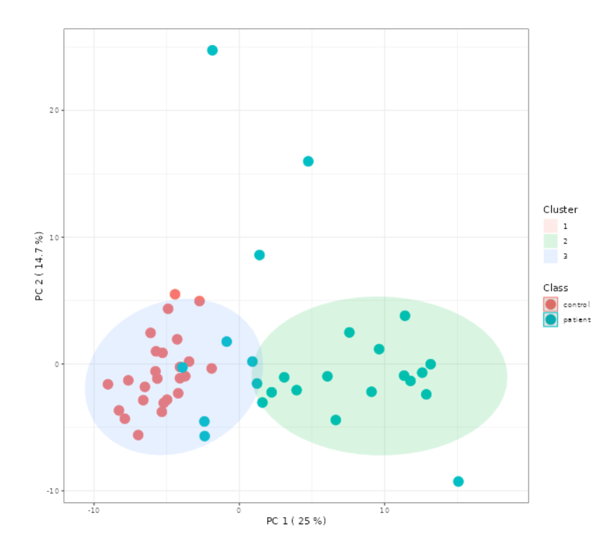

## Zadanie 4 (5b)

V tomto zadaní budete pracovať s nástrojom MetaboAnalyst a datasetom: **NMR spectral bins**
    
`Binned 1H NMR spectra of 50 urine samples using 0.04 ppm constant width (Psihogios NG, et al.) Group 1- control; group 2 - severe kidney disease.`
    
Tento dataset je dostupný v sekcii 'Try our test data' v nástroji pre Jednofaktorovú štatistickú analýzu. 

Dataset pochádza z NMR-metabolomickej štúdie: Hodnotenie závažnosti tubulointersticiálnych lézií u pacientov s glomerulonefritídou. Začiatok tubulointersticiálnych lézií je charakterizovaný zníženým vylučovaním citrátu, hipurátu, glycínu a kreatinínu, zatiaľ čo po ďalšom zhoršení nasleduje glykozúria, selektívna aminoacidúria, úplné vyčerpanie citrátu a hipurátu a postupné zvyšovanie vylučovania laktátu, acetátu a trimetylamín-N-oxidu. Metabonomická analýza moču založená na NMR by mohla prispieť k včasnému hodnoteniu závažnosti poškodenia obličiek a prípadne k monitorovaniu ich funkcie. [1]

Načítajte množinu údajov v nástroji MetaboAnalyst. Pri filtrovaní údajov (Data filter) môžete použiť predvolené nastavenia.

### Úloha 1 (1b)

Normalizujte distribúciu datasetu (pre premenné aj vzorku).
(Vyberte akúkoľvek kombináciu operácií, ktorá je podľa Vás najlepšia).

**Ktoré operácie ste pri normalizácii použili?**
Sample normalization: Normalization by median
Data Transformation:  Square root transformation
Data Scaling:         Auto scaling
### Úloha 2 (4b)

Použite ľubovoľné štatistické metódy na analýzu datasetu (napr. t-test, correlations, PCA, PLS-DA, Dendrogram, Heatmap, K-means, RandomForest, ..) 

**Uveďte aspoň 4 skutočnosti (z 4 rôznych metód), ktoré ste zistili analýzou datasetu:**

(Napr. Pri použití pearsonovho korelačného koeficientu je najvyššia pozitívna korelácia medzi premennými x a y, a koeficient korelácie je 0.992.)
1: Two-sample t-tests & Wilcoxon rank-sum tests - Pri použití two-sample t-testu sa ukázal významný rozdiel medzi skupinami pri znaku č. 22, kde hodnota –log10(p) prekročila 8, čo znamená p-hodnotu menšiu ako 10⁻⁸. Tento znak teda výrazne odlišuje obe skupiny a je štatisticky veľmi významný.
Pri použití Wilcoxonovho rank-sum testu sme tiež identifikovali významný rozdiel pri znaku č. 135, kde hodnota –log10(p) presahuje 10. To potvrdzuje, že rozdiel medzi skupinami je signifikantný aj bez predpokladu normality.
 
2:  Sparse PLS-DA - Pri použití metódy Sparse PLS-DA bolo pozorované výrazné oddelenie dvoch skupín (červené krúžky a zelené trojuholníky) pozdĺž komponentu 1, ktorý vysvetľuje 20,3 % variability v dátach. To naznačuje, že táto komponenta má najväčší prínos pri rozlíšení skupín, čo potvrdzuje, že medzi skupinami existujú rozdiely na základe viacrozmerného profilu znakov. 
3: K-means clustering + PCA - Pri použití metódy K-means clustering s vizualizáciou pomocou PCA sa ukázalo, že vzorka sa prirodzene rozdeľuje do 3 klastrov. Zároveň je zrejmé, že:

Klastre do veľkej miery korešpondujú s triedami "control" a "patient" – kontrolná skupina (červené body) je prevažne v jednom klastri (modrý elipsový obal), zatiaľ čo pacienti (modré body) sa zoskupujú do iného klastra (zelený elipsový obal).

Prvá hlavná komponenta (PC1) vysvetľuje 25 % variability, čo znamená, že najväčšie rozdiely medzi klastrami (a teda aj skupinami) sa prejavujú najmä pozdĺž tejto osi.

Táto analýza potvrdzuje, že K-means efektívne rozlišuje skupiny na základe vzorov v dátach, čo môže pomôcť pri diagnostike alebo triedení vzoriek podľa profilu.

4: Random Forest - OOB (Out-of-Bag) chyba je 0.04, čo znamená, že model má veľmi vysokú presnosť (96 %) na nevidených dátach. OOB chyba je interný spôsob validácie v Random Foreste bez potreby extra validačnej množiny.

Z mätúcej matice:
Trieda "control" bola klasifikovaná bezchybne (25/25).
Trieda "patient" mala 2 nesprávne klasifikácie z 25, teda chybovosť pre túto triedu je 0.08.

Z grafu vývoja chýb cez počet stromov:
Chyby pre všetky triedy aj celková chyba sa ustálili už okolo 100 stromov, čo naznačuje, že 500 stromov je možno nadbytočných, ale prispieva k stabilite modelu.
Modrá čiara (chyba pre "patient") ukazuje mierne vyššiu a rozkolísanejšiu chybu ako zelená (control), čo zodpovedá aj vyššej chybovosti tejto triedy.

Vygenerujte report z vykonanej analýzy a celý výsledný zip file odovzdajte ako prílohu k riešeniu zadania.

----

#### Referencie

[1] Psihogios, N. G., Kalaitzidis, R. G., Dimou, S., Seferiadis, K. I., Siamopoulos, K. C., & Bairaktari, E. T. (2007). Evaluation of tubulointerstitial lesions’ severity in patients with glomerulonephritides: an NMR-based metabonomic study. Journal of Proteome Research, 6(9), 3760–3770. https://doi.org/10.1021/PR070172W
